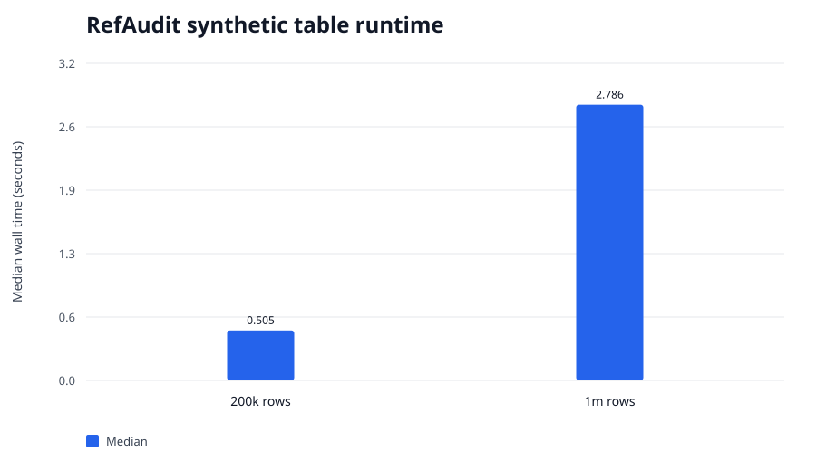

# Synthetic scale and determinism benchmark — 2026-09-03

This controlled benchmark measures processing of deterministic long-format comparison tables. It
does not establish that any reference genome is preferable or that synthetic shifts represent a
particular assay.

## Environment and source

- Host: Apple M2 Max (`Mac14,6`), 12 logical CPUs, 96 GiB RAM, macOS-14.7.6-arm64-arm-64bit, Python 3.12.7, Rust/Cargo 1.98.1
- RefAudit commit: `661545d8c4191df2224b46346e72de972066497b`
- Working tree: clean
- Replicates: three independent complete harness invocations

## Results

Each key appears once under `hg38` and once under `t2t`, so 500,000 comparable keys produce one
million input rows. Every primary/repeat pair generated byte-identical JSON within its run.

Times and peak RSS are medians with observed three-run ranges in brackets.

| Comparable keys | Input rows | Wall time, s | Peak RSS, MiB | Approx. rows/s | Same-run repeat output |
|---:|---:|---:|---:|---:|---|
| 100,000 | 200,000 | 0.505 [0.505–0.522] | 87.7 [87.6–88.8] | 395,666 | byte-identical |
| 500,000 | 1,000,000 | 2.786 [2.690–2.884] | 442.4 [429.6–445.1] | 358,893 | byte-identical |



Runtime and memory both grew approximately with input size. The one-million-row case completed in
a median 2.79 seconds but used a median
442 MiB peak RSS. Reducing memory growth is therefore a more valuable
optimization target than improving this synthetic parse time.

## Determinism qualification

The first and repeated output inside each run were byte-identical because the command and input
path were identical. Hashes differed across the three run directories because the report records
the source path. Do not claim path-independent byte identity from this experiment.

## Limitations

- Values and sparse shifts are synthetic and do not model a specific omics pipeline.
- The benchmark measures one candidate reference against one baseline.
- Peak memory is substantial because the current implementation retains the validated table.
- No competing auditing implementation was benchmarked.

## Reproduction

```bash
python3 -u benchmark.py run --profile standard --label refaudit-r1 --tool refaudit
```
